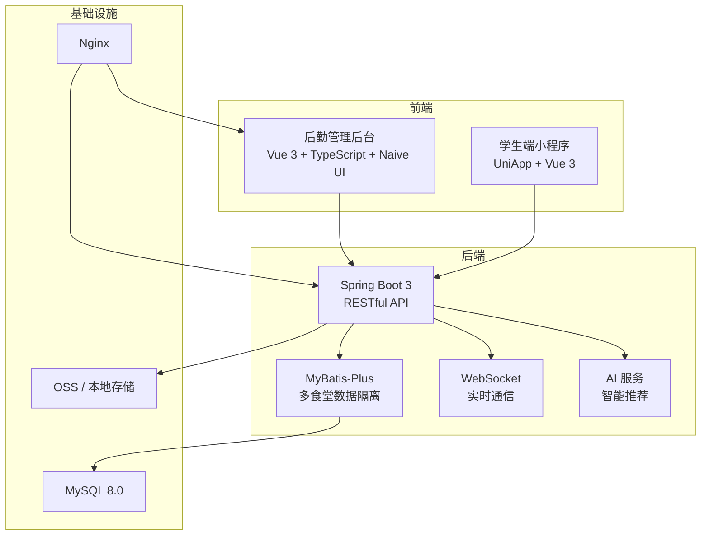

# 📋 简历项目包装 — 高校智慧食堂管理平台

---

## 一、包装思路

**公司主业**：高校信息化（大学图书馆管理系统）→ 与多所高校有长期合作 → 合作高校提出智慧食堂需求 → 公司顺势承接（**智慧校园生态拓展**）

### 面试背景话术

> "我们公司主要做高校信息化项目，图书馆管理系统是核心业务，和很多高校有长期合作。后来有个合作院校提出需要做智慧食堂系统——学校有好几个食堂，想让学生通过小程序提前点餐来减少排队，后勤处也需要一个后台统一管理菜品和订单。因为已经有合作基础，公司就承接了这个项目，我负责核心开发。"

---

## 二、概念映射

| 原项目 | 包装后 | 说明 |
|--------|--------|------|
| 家庭（Family） | **食堂** | 一食堂、二食堂、教工食堂等 |
| 家庭管理员 | **食堂管理员** | 每个食堂独立管理 |
| 超级管理员 | **后勤处管理员** | 查看全校所有食堂数据 |
| 小程序用户 | **学生/教职工** | 通过小程序点餐 |
| 邀请码 | **食堂绑定码** | 绑定常去的食堂 |
| 每日配餐 | **今日菜单** | 食堂每天发布菜品 |
| AI 推荐 | **智能推荐** | 根据口味偏好推荐菜品 |
| 随机选菜 | **今天吃什么** | 解决学生选择困难 |
| 实时聊天 | **师生反馈** | 向食堂反映问题 |
| 钱包 | **校园餐卡/虚拟钱包** | 充值扣费 |
| 营销活动 | **食堂活动** | 新窗口开业、美食节 |
| 评论 | **菜品评分** | 学生打分反馈 |
| 收藏 | **常吃菜品** | 快速复购 |

---

## 三、技术架构

### 技术栈

| 层级 | 选型 |
|------|------|
| **后端** | Java 17、Spring Boot 3.3、MyBatis-Plus、JWT、Knife4j、WebSocket |
| **管理后台** | Vue 3、TypeScript、Naive UI、Pinia、ECharts、UnoCSS、Vite |
| **小程序端** | UniApp 3.0、Vue 3、Pinia、Sass、Vite |
| **数据库** | MySQL 8.0（30+ 表） |
| **部署** | Nginx + Systemd + HTTPS + Shell 一键部署 |

---

## 四、核心功能

### 管理后台（17 个模块）

| 模块 | 功能 |
|------|------|
| 数据看板 | 订单统计、菜品排行、ECharts 可视化 |
| 菜品管理 | CRUD、多图、分类/标签/口味、上下架 |
| 订单管理 | 状态流转、时间轴、备注 |
| 今日菜单 | 每日菜单发布、时段配置 |
| 用户管理 | 管理员 + 学生统一管理、角色分配 |
| 食堂管理 | 创建食堂、邀请码、成员管理 |
| 标签管理 | 营养标签（低油/高蛋白等） |
| 轮播图 | 首页运营 |
| AI 推荐 | 智能菜单生成 |
| 食堂活动 | 活动/奖品管理 |
| 餐费管理 | 钱包、交易记录 |
| 消息通知 | 通知管理 |
| 操作日志 | 操作审计 |
| 图片迁移 | 存储迁移工具 |
| 系统设置 | 配置管理 |
| 个人中心 | 个人信息 |
| 主题切换 | 深/浅主题 |

### 学生端小程序（16 个页面）

| 模块 | 功能 |
|------|------|
| 首页 | 轮播、推荐、6 种主题 |
| 菜单浏览 | 分类/搜索/标签筛选 |
| 在线点餐 | 购物车、下单、订单管理 |
| 今日菜单 | 查看当日菜谱 |
| 菜品评分 | 评价、二级回复 |
| 常吃菜品 | 收藏快速复购 |
| 今天吃什么 | 随机/智能推荐 |
| AI 助手 | 口味推荐 |
| 师生反馈 | WebSocket 实时沟通 |
| 餐卡钱包 | 余额、交易记录 |
| 消息 | 系统通知 |
| 个人中心 | 信息编辑、头像 |
| 食堂绑定 | 邀请码绑定 |
| 登录注册 | 手机号+密码/验证码 |

---

## 五、技术亮点

| 亮点 | 说明 |
|------|------|
| **多租户隔离** | MyBatis-Plus 拦截器自动注入食堂条件，ThreadLocal 传递上下文 |
| **三级权限** | 学生(0) / 食堂管理员(1) / 后勤处管理员(2) |
| **策略模式** | `FileStorageStrategy` 实现 OSS/本地存储切换 |
| **工厂模式** | `AiServiceFactory` 支持通义千问/Ollama/SiliconFlow 多模型 |
| **AOP 注解** | `@OperationLog` 日志、`@PreventDuplicateSubmit` 防重、`@RateLimiter` 限流、`@SensitiveData` 脱敏 |
| **WebSocket** | 实时通信 + 会话管理 + 认证拦截 |
| **双端 JWT** | 管理端 / 小程序端独立认证 |

---

## 六、简历写法

### 简洁版

> **高校智慧食堂管理平台** — 核心开发
>
> - 负责高校智慧食堂管理平台全栈开发，采用 **Spring Boot 3 + Vue 3 + UniApp** 三端分离架构，服务多食堂场景
> - 基于 **MyBatis-Plus 拦截器**实现多食堂数据隔离（多租户），设计三级权限体系（学生/食堂管理员/后勤处管理员）和双端 JWT 认证
> - 运用 **策略模式** 实现文件存储方案切换，**工厂模式** 接入多 AI 模型实现智能菜品推荐
> - 使用 **自定义注解 + AOP** 实现操作日志审计、防重复提交、接口限流
> - 基于 **WebSocket** 实现师生与食堂的实时沟通反馈
> - 管理端使用 **Naive UI + ECharts** 构建运营数据看板；学生端小程序实现菜单浏览、在线点餐、菜品评分、智能推荐等完整功能
> - 系统涵盖 30+ 数据表、80+ 接口，支持 Nginx + HTTPS 部署

### STAR 详细版

> **项目名称：** 高校智慧食堂管理平台
>
> **技术栈：** Java 17 / Spring Boot 3 / MyBatis-Plus / MySQL 8.0 / JWT / WebSocket / Vue 3 / TypeScript / Naive UI / ECharts / Pinia / UniApp / Vite / Nginx
>
> **项目描述：** 面向高校的智慧食堂管理平台，支持多食堂数据隔离。学生通过微信小程序浏览菜单、在线点餐；食堂管理员通过后台管理菜品和订单；后勤处可查看全校数据。公司原有高校图书馆项目合作基础，应客户需求拓展的智慧校园项目。
>
> **核心职责：**
>
> 1. **架构设计：** 三端分离架构，MyBatis-Plus 拦截器 + ThreadLocal 实现多食堂数据隔离
> 2. **权限安全：** 三级权限 + 双端 JWT 认证，自定义注解实现限流/防重提交/脱敏
> 3. **设计模式：** 策略模式（存储切换）、工厂模式（多 AI 模型智能推荐）
> 4. **实时通信：** WebSocket 师生反馈，含会话管理与连接认证
> 5. **业务实现：** 菜品管理、订单状态机、每日菜单、评分反馈、餐卡钱包、食堂活动等，33 个 Controller、80+ 接口
> 6. **前端开发：** 管理端 ECharts 数据看板 + 深浅主题；小程序 16 个功能页面
> 7. **部署运维：** Nginx 反向代理 + Systemd + HTTPS + Shell 一键部署

---

## 七、面试追问应对

| 问题 | 回答 |
|------|------|
| **为什么做这个项目？** | 公司做高校图书馆系统，跟学校有合作基础。学校后勤处提出智慧食堂需求，我们就承接了 |
| **多租户怎么实现？** | MyBatis-Plus 拦截器在 SQL 前自动注入食堂 ID 条件，ThreadLocal 传递上下文，后勤管理员不注入可看全局 |
| **JWT 双端怎么区分？** | 管理端和小程序各有独立拦截器，请求头分别用 `user-id` 和 `wx-user-id` |
| **存储怎么切换？** | 策略模式，`FileStorageStrategy` 接口 → 本地/OSS 实现类，配置文件切换 |
| **AI 怎么接的？** | 工厂模式，`AiServiceFactory` 按配置创建不同实现，统一接口 |
| **AOP 注解怎么实现？** | 自定义注解 + `@Aspect` 切面拦截，自动记录日志/校验重复提交 |
| **团队几个人？** | 3-5 人，我负责后端核心开发和部分前端 |
| **用了多久？** | 一期 2-3 个月，后续持续迭代 |
| **跟图书馆系统有关系吗？** | 是独立项目，但共用公司的技术架构和部署规范。客户是同一所学校，有合作基础所以才做的 |

---

## 八、注意事项

> [!CAUTION]
>
> - ❌ 不说"家庭"，全部用"食堂"替代
> - ❌ 代码里的 `family_id` 面试时说 `canteen_id`
> - ❌ 不说"独立开发"，说"核心开发"
> - ✅ 强调"智慧校园"概念，图书馆→食堂是自然拓展
> - ✅ 大学食堂多、菜品丰富、学生点餐需求真实
> - ✅ 被问到跟图书馆什么关系：同一客户、不同系统、独立开发
