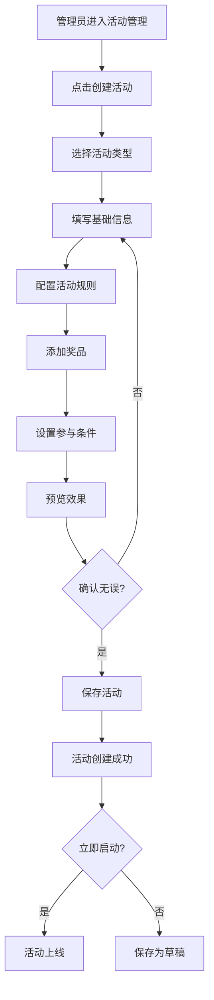
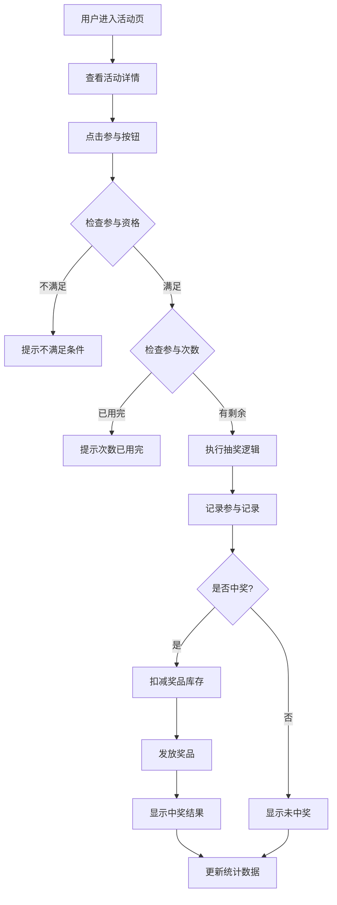
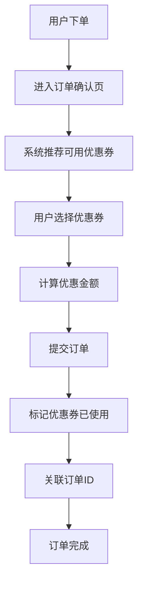

# 营销活动模块设计方案

## 📋 方案概述

为家宴菜单管理系统设计一个灵活、可扩展的营销活动模块,支持多种活动类型(抽奖、大转盘、优惠券、积分兑换等),实现后台统一配置、小程序端展示和参与的完整闭环。

---

## 🎯 核心设计理念

### 1. 活动类型可扩展

采用**策略模式**设计,支持灵活添加新活动类型,无需修改核心代码。

### 2. 配置化驱动

所有活动参数、规则、奖品均可在后台配置,无需修改代码即可上线新活动。

### 3. 多家庭隔离

延续现有的 `family_id` 机制,每个家庭可独立配置自己的营销活动。

### 4. 数据驱动决策

完整的活动数据统计和分析,帮助家庭管理员优化活动策略。

---

## 🗄️ 数据库设计

### 核心数据表

#### 1. `marketing_activity` - 营销活动主表

```sql
CREATE TABLE `marketing_activity` (
  `id` BIGINT PRIMARY KEY AUTO_INCREMENT COMMENT '活动ID',
  `family_id` BIGINT NOT NULL COMMENT '家庭ID',
  `activity_name` VARCHAR(100) NOT NULL COMMENT '活动名称',
  `activity_type` VARCHAR(50) NOT NULL COMMENT '活动类型: LOTTERY(抽奖), WHEEL(大转盘), COUPON(优惠券), POINTS_EXCHANGE(积分兑换), SIGN_IN(签到), GROUP_BUY(拼团)',
  `activity_desc` TEXT COMMENT '活动描述',
  `banner_image` VARCHAR(500) COMMENT '活动横幅图片',
  `start_time` DATETIME NOT NULL COMMENT '开始时间',
  `end_time` DATETIME NOT NULL COMMENT '结束时间',
  `status` TINYINT DEFAULT 0 COMMENT '状态: 0-未开始, 1-进行中, 2-已结束, 3-已暂停',
  `participate_limit` INT DEFAULT 0 COMMENT '参与次数限制(0表示不限制)',
  `limit_type` VARCHAR(20) DEFAULT 'DAILY' COMMENT '限制类型: DAILY(每日), TOTAL(总计), UNLIMITED(不限)',
  `participate_condition` JSON COMMENT '参与条件配置(JSON格式)',
  `activity_config` JSON NOT NULL COMMENT '活动配置(JSON格式,不同活动类型配置不同)',
  `sort_order` INT DEFAULT 0 COMMENT '排序权重',
  `create_time` DATETIME DEFAULT CURRENT_TIMESTAMP,
  `update_time` DATETIME DEFAULT CURRENT_TIMESTAMP ON UPDATE CURRENT_TIMESTAMP,
  `create_by` BIGINT COMMENT '创建人',
  `update_by` BIGINT COMMENT '更新人',
  INDEX `idx_family_id` (`family_id`),
  INDEX `idx_activity_type` (`activity_type`),
  INDEX `idx_status` (`status`),
  INDEX `idx_time` (`start_time`, `end_time`)
) ENGINE=InnoDB DEFAULT CHARSET=utf8mb4 COMMENT='营销活动主表';
```

#### 2. `activity_prize` - 活动奖品表

```sql
CREATE TABLE `activity_prize` (
  `id` BIGINT PRIMARY KEY AUTO_INCREMENT COMMENT '奖品ID',
  `activity_id` BIGINT NOT NULL COMMENT '活动ID',
  `prize_name` VARCHAR(100) NOT NULL COMMENT '奖品名称',
  `prize_type` VARCHAR(50) NOT NULL COMMENT '奖品类型: COUPON(优惠券), POINTS(积分), DISH(菜品), PHYSICAL(实物), THANK_YOU(谢谢参与)',
  `prize_image` VARCHAR(500) COMMENT '奖品图片',
  `prize_value` DECIMAL(10,2) COMMENT '奖品价值',
  `prize_config` JSON COMMENT '奖品配置(如优惠券ID、菜品ID等)',
  `total_quantity` INT DEFAULT -1 COMMENT '总数量(-1表示无限)',
  `remain_quantity` INT DEFAULT -1 COMMENT '剩余数量',
  `win_probability` DECIMAL(5,4) COMMENT '中奖概率(0.0001-1.0000)',
  `prize_level` INT DEFAULT 0 COMMENT '奖品等级(用于排序展示)',
  `create_time` DATETIME DEFAULT CURRENT_TIMESTAMP,
  `update_time` DATETIME DEFAULT CURRENT_TIMESTAMP ON UPDATE CURRENT_TIMESTAMP,
  INDEX `idx_activity_id` (`activity_id`),
  FOREIGN KEY (`activity_id`) REFERENCES `marketing_activity`(`id`) ON DELETE CASCADE
) ENGINE=InnoDB DEFAULT CHARSET=utf8mb4 COMMENT='活动奖品表';
```

#### 3. `activity_participate_record` - 活动参与记录表

```sql
CREATE TABLE `activity_participate_record` (
  `id` BIGINT PRIMARY KEY AUTO_INCREMENT COMMENT '记录ID',
  `activity_id` BIGINT NOT NULL COMMENT '活动ID',
  `wx_user_id` BIGINT NOT NULL COMMENT '参与用户ID',
  `participate_time` DATETIME DEFAULT CURRENT_TIMESTAMP COMMENT '参与时间',
  `prize_id` BIGINT COMMENT '中奖奖品ID(NULL表示未中奖)',
  `is_win` TINYINT DEFAULT 0 COMMENT '是否中奖: 0-未中奖, 1-已中奖',
  `prize_status` TINYINT DEFAULT 0 COMMENT '奖品状态: 0-未领取, 1-已领取, 2-已使用, 3-已过期',
  `claim_time` DATETIME COMMENT '领取时间',
  `use_time` DATETIME COMMENT '使用时间',
  `expire_time` DATETIME COMMENT '过期时间',
  `extra_data` JSON COMMENT '额外数据(如抽奖结果详情)',
  INDEX `idx_activity_user` (`activity_id`, `wx_user_id`),
  INDEX `idx_user_id` (`wx_user_id`),
  INDEX `idx_participate_time` (`participate_time`),
  FOREIGN KEY (`activity_id`) REFERENCES `marketing_activity`(`id`) ON DELETE CASCADE,
  FOREIGN KEY (`prize_id`) REFERENCES `activity_prize`(`id`) ON DELETE SET NULL
) ENGINE=InnoDB DEFAULT CHARSET=utf8mb4 COMMENT='活动参与记录表';
```

#### 4. `user_coupon` - 用户优惠券表

```sql
CREATE TABLE `user_coupon` (
  `id` BIGINT PRIMARY KEY AUTO_INCREMENT COMMENT '优惠券ID',
  `wx_user_id` BIGINT NOT NULL COMMENT '用户ID',
  `coupon_name` VARCHAR(100) NOT NULL COMMENT '优惠券名称',
  `coupon_type` VARCHAR(50) NOT NULL COMMENT '优惠券类型: DISCOUNT(折扣券), CASH(代金券), FREE_DISH(免费菜品券)',
  `coupon_value` DECIMAL(10,2) NOT NULL COMMENT '优惠券面值',
  `min_order_amount` DECIMAL(10,2) DEFAULT 0 COMMENT '最低消费金额',
  `source_type` VARCHAR(50) COMMENT '来源类型: ACTIVITY(活动), MANUAL(手动发放), SYSTEM(系统赠送)',
  `source_id` BIGINT COMMENT '来源ID(如活动ID)',
  `status` TINYINT DEFAULT 0 COMMENT '状态: 0-未使用, 1-已使用, 2-已过期',
  `receive_time` DATETIME DEFAULT CURRENT_TIMESTAMP COMMENT '领取时间',
  `use_time` DATETIME COMMENT '使用时间',
  `expire_time` DATETIME NOT NULL COMMENT '过期时间',
  `order_id` BIGINT COMMENT '使用的订单ID',
  INDEX `idx_user_id` (`wx_user_id`),
  INDEX `idx_status` (`status`),
  INDEX `idx_expire_time` (`expire_time`),
  FOREIGN KEY (`wx_user_id`) REFERENCES `wx_user`(`id`) ON DELETE CASCADE
) ENGINE=InnoDB DEFAULT CHARSET=utf8mb4 COMMENT='用户优惠券表';
```

#### 5. `activity_statistics` - 活动统计表

```sql
CREATE TABLE `activity_statistics` (
  `id` BIGINT PRIMARY KEY AUTO_INCREMENT COMMENT '统计ID',
  `activity_id` BIGINT NOT NULL COMMENT '活动ID',
  `stat_date` DATE NOT NULL COMMENT '统计日期',
  `total_participants` INT DEFAULT 0 COMMENT '总参与人数',
  `total_participations` INT DEFAULT 0 COMMENT '总参与次数',
  `total_winners` INT DEFAULT 0 COMMENT '总中奖人数',
  `total_wins` INT DEFAULT 0 COMMENT '总中奖次数',
  `total_prize_value` DECIMAL(10,2) DEFAULT 0 COMMENT '总奖品价值',
  `conversion_rate` DECIMAL(5,4) DEFAULT 0 COMMENT '转化率',
  `create_time` DATETIME DEFAULT CURRENT_TIMESTAMP,
  `update_time` DATETIME DEFAULT CURRENT_TIMESTAMP ON UPDATE CURRENT_TIMESTAMP,
  UNIQUE KEY `uk_activity_date` (`activity_id`, `stat_date`),
  FOREIGN KEY (`activity_id`) REFERENCES `marketing_activity`(`id`) ON DELETE CASCADE
) ENGINE=InnoDB DEFAULT CHARSET=utf8mb4 COMMENT='活动统计表';
```

---

## 🎨 活动类型详细设计

### 1. 抽奖活动 (LOTTERY)

**活动配置 JSON 示例:**

```json
{
  "lotteryType": "GRID",  // GRID(九宫格), SLOT(老虎机), SCRATCH(刮刮卡)
  "gridLayout": "3x3",    // 九宫格布局
  "animationDuration": 3000,  // 动画时长(ms)
  "buttonText": "立即抽奖",
  "rules": [
    "每人每天可抽奖3次",
    "中奖后自动发放到账户",
    "奖品有效期7天"
  ]
}
```

**参与条件 JSON 示例:**

```json
{
  "minOrderCount": 1,      // 最少下单次数
  "minOrderAmount": 50,    // 最少消费金额
  "requiredTags": ["VIP"], // 需要的用户标签
  "pointsCost": 100        // 消耗积分数
}
```

**前端展示:**

- 九宫格抽奖界面,炫酷动画效果
- 显示剩余抽奖次数
- 中奖后弹窗展示奖品
- 我的奖品列表

### 2. 大转盘活动 (WHEEL)

**活动配置 JSON 示例:**

```json
{
  "wheelType": "CLASSIC",  // CLASSIC(经典), POINTER(指针式)
  "sectorCount": 8,        // 扇区数量
  "rotationSpeed": 5,      // 旋转速度
  "rotationDuration": 4000, // 旋转时长(ms)
  "buttonText": "开始抽奖",
  "wheelColors": ["#FF6B6B", "#4ECDC4", "#45B7D1", "#FFA07A"],
  "rules": [
    "每人每天可转1次",
    "100%中奖",
    "奖品实时到账"
  ]
}
```

**前端展示:**

- 大转盘旋转动画,支持惯性效果
- 指针指向中奖区域
- 音效配合(可选)
- 中奖记录滚动展示

### 3. 优惠券发放活动 (COUPON)

**活动配置 JSON 示例:**

```json
{
  "couponList": [
    {
      "couponName": "满50减10元",
      "couponType": "CASH",
      "couponValue": 10,
      "minOrderAmount": 50,
      "quantity": 100,
      "validDays": 7
    },
    {
      "couponName": "8折优惠券",
      "couponType": "DISCOUNT",
      "couponValue": 0.8,
      "minOrderAmount": 0,
      "quantity": 200,
      "validDays": 30
    }
  ],
  "receiveLimit": 3,  // 每人限领数量
  "buttonText": "立即领取"
}
```

**前端展示:**

- 优惠券卡片展示
- 一键领取按钮
- 我的优惠券列表
- 下单时自动推荐可用优惠券

### 4. 积分兑换活动 (POINTS_EXCHANGE)

**活动配置 JSON 示例:**

```json
{
  "exchangeItems": [
    {
      "itemName": "免费菜品券",
      "itemType": "COUPON",
      "pointsCost": 500,
      "itemValue": 20,
      "stock": 50
    },
    {
      "itemName": "精美餐具",
      "itemType": "PHYSICAL",
      "pointsCost": 1000,
      "stock": 10,
      "needAddress": true
    }
  ],
  "pointsSource": "ORDER_AMOUNT",  // 积分来源: ORDER_AMOUNT(消费金额), SIGN_IN(签到)
  "pointsRatio": 0.1  // 积分比例(消费1元=0.1积分)
}
```

**前端展示:**

- 积分商城界面
- 我的积分余额显示
- 兑换记录
- 物流跟踪(实物奖品)

### 5. 签到活动 (SIGN_IN)

**活动配置 JSON 示例:**

```json
{
  "signInType": "CONTINUOUS",  // CONTINUOUS(连续签到), CUMULATIVE(累计签到)
  "rewards": [
    {"day": 1, "points": 10, "couponId": null},
    {"day": 3, "points": 20, "couponId": 123},
    {"day": 7, "points": 50, "couponId": 124},
    {"day": 15, "points": 100, "couponId": 125},
    {"day": 30, "points": 300, "couponId": 126}
  ],
  "resetOnMiss": true,  // 漏签是否重置
  "makeUpEnabled": true,  // 是否允许补签
  "makeUpCost": 50  // 补签消耗积分
}
```

**前端展示:**

- 签到日历
- 连续签到天数显示
- 签到奖励预览
- 补签功能

### 6. 拼团活动 (GROUP_BUY)

**活动配置 JSON 示例:**

```json
{
  "groupSize": 3,  // 成团人数
  "groupPrice": 88,  // 拼团价
  "originalPrice": 128,  // 原价
  "groupDuration": 24,  // 成团时限(小时)
  "dishIds": [1, 2, 3],  // 参与拼团的菜品
  "maxGroupsPerUser": 5,  // 每人最多发起拼团数
  "allowJoinMultiple": true  // 是否允许参加多个团
}
```

**前端展示:**

- 拼团商品列表
- 发起拼团/参与拼团
- 拼团进度显示
- 拼团成功/失败通知

---

## 💻 后端架构设计

### 1. 实体类 (Entity)

```
entity/
├── MarketingActivity.java       // 营销活动实体
├── ActivityPrize.java            // 活动奖品实体
├── ActivityParticipateRecord.java // 参与记录实体
├── UserCoupon.java               // 用户优惠券实体
└── ActivityStatistics.java       // 活动统计实体
```

### 2. DTO 类 (Data Transfer Object)

```
dto/
├── ActivityCreateDto.java        // 创建活动DTO
├── ActivityUpdateDto.java        // 更新活动DTO
├── ActivityDetailDto.java        // 活动详情DTO
├── ActivityListDto.java          // 活动列表DTO
├── PrizeConfigDto.java           // 奖品配置DTO
├── ParticipateRequestDto.java    // 参与活动请求DTO
├── ParticipateResultDto.java     // 参与活动结果DTO
├── ActivityStatisticsDto.java    // 活动统计DTO
└── UserCouponDto.java            // 用户优惠券DTO
```

### 3. Service 层设计

#### 核心服务接口

```java
// 活动管理服务
public interface MarketingActivityService {
    // 创建活动
    Long createActivity(ActivityCreateDto dto);
    
    // 更新活动
    void updateActivity(Long id, ActivityUpdateDto dto);
    
    // 删除活动
    void deleteActivity(Long id);
    
    // 获取活动详情
    ActivityDetailDto getActivityDetail(Long id);
    
    // 获取活动列表(管理端)
    PageResult<ActivityListDto> getActivityList(ActivityQueryDto query);
    
    // 获取进行中的活动列表(小程序端)
    List<ActivityListDto> getActiveActivities();
    
    // 启动/暂停活动
    void updateActivityStatus(Long id, Integer status);
}

// 活动参与服务
public interface ActivityParticipateService {
    // 检查参与资格
    ParticipateEligibilityDto checkEligibility(Long activityId, Long userId);
    
    // 参与活动
    ParticipateResultDto participate(Long activityId, Long userId);
    
    // 获取用户参与记录
    List<ParticipateRecordDto> getUserParticipateRecords(Long userId);
    
    // 领取奖品
    void claimPrize(Long recordId);
}

// 奖品管理服务
public interface ActivityPrizeService {
    // 添加奖品
    Long addPrize(Long activityId, PrizeConfigDto dto);
    
    // 更新奖品
    void updatePrize(Long prizeId, PrizeConfigDto dto);
    
    // 删除奖品
    void deletePrize(Long prizeId);
    
    // 获取活动奖品列表
    List<PrizeConfigDto> getActivityPrizes(Long activityId);
    
    // 抽奖算法
    ActivityPrize drawPrize(Long activityId);
}

// 优惠券服务
public interface UserCouponService {
    // 发放优惠券
    void issueCoupon(Long userId, CouponConfigDto config);
    
    // 获取用户优惠券列表
    List<UserCouponDto> getUserCoupons(Long userId, Integer status);
    
    // 使用优惠券
    void useCoupon(Long couponId, Long orderId);
    
    // 获取订单可用优惠券
    List<UserCouponDto> getAvailableCoupons(Long userId, BigDecimal orderAmount);
}

// 活动统计服务
public interface ActivityStatisticsService {
    // 生成每日统计
    void generateDailyStatistics(Long activityId, LocalDate date);
    
    // 获取活动统计数据
    ActivityStatisticsDto getActivityStatistics(Long activityId, LocalDate startDate, LocalDate endDate);
    
    // 获取活动排行榜
    List<ActivityRankDto> getActivityRank(Long activityId, String rankType);
}
```

#### 策略模式 - 活动类型处理器

```java
// 活动处理器接口
public interface ActivityHandler {
    // 支持的活动类型
    String getSupportedType();
    
    // 验证活动配置
    void validateConfig(JSONObject config);
    
    // 处理参与逻辑
    ParticipateResultDto handleParticipate(MarketingActivity activity, Long userId);
    
    // 获取活动详情(前端展示用)
    ActivityDetailDto getActivityDetail(MarketingActivity activity);
}

// 实现类
@Service
public class LotteryActivityHandler implements ActivityHandler {
    @Override
    public String getSupportedType() {
        return "LOTTERY";
    }
    
    @Override
    public ParticipateResultDto handleParticipate(MarketingActivity activity, Long userId) {
        // 抽奖逻辑
        // 1. 检查参与次数
        // 2. 执行抽奖算法
        // 3. 记录参与记录
        // 4. 发放奖品
        // 5. 返回结果
    }
}

@Service
public class WheelActivityHandler implements ActivityHandler {
    // 大转盘逻辑
}

@Service
public class CouponActivityHandler implements ActivityHandler {
    // 优惠券发放逻辑
}

// 活动处理器工厂
@Component
public class ActivityHandlerFactory {
    private final Map<String, ActivityHandler> handlerMap;
    
    public ActivityHandlerFactory(List<ActivityHandler> handlers) {
        this.handlerMap = handlers.stream()
            .collect(Collectors.toMap(ActivityHandler::getSupportedType, h -> h));
    }
    
    public ActivityHandler getHandler(String activityType) {
        ActivityHandler handler = handlerMap.get(activityType);
        if (handler == null) {
            throw new BusinessException("不支持的活动类型: " + activityType);
        }
        return handler;
    }
}
```

### 4. Controller 层设计

```
controller/
├── AdminMarketingActivityController.java  // 管理端活动控制器
├── UniappMarketingActivityController.java // 小程序端活动控制器
├── AdminActivityPrizeController.java      // 管理端奖品控制器
├── UniappUserCouponController.java        // 小程序端优惠券控制器
└── AdminActivityStatisticsController.java // 管理端统计控制器
```

**关键接口示例:**

```java
// 管理端活动控制器
@RestController
@RequestMapping("/admin/marketing/activity")
public class AdminMarketingActivityController {
    
    @PostMapping
    public Result<Long> createActivity(@RequestBody ActivityCreateDto dto) {
        // 创建活动
    }
    
    @PutMapping("/{id}")
    public Result<Void> updateActivity(@PathVariable Long id, @RequestBody ActivityUpdateDto dto) {
        // 更新活动
    }
    
    @GetMapping("/page")
    public Result<PageResult<ActivityListDto>> getActivityPage(ActivityQueryDto query) {
        // 分页查询活动列表
    }
    
    @GetMapping("/{id}")
    public Result<ActivityDetailDto> getActivityDetail(@PathVariable Long id) {
        // 获取活动详情
    }
    
    @PutMapping("/{id}/status")
    public Result<Void> updateStatus(@PathVariable Long id, @RequestParam Integer status) {
        // 更新活动状态
    }
    
    @GetMapping("/{id}/statistics")
    public Result<ActivityStatisticsDto> getStatistics(@PathVariable Long id) {
        // 获取活动统计
    }
}

// 小程序端活动控制器
@RestController
@RequestMapping("/uniapp/marketing/activity")
public class UniappMarketingActivityController {
    
    @GetMapping("/list")
    public Result<List<ActivityListDto>> getActiveActivities() {
        // 获取进行中的活动列表
    }
    
    @GetMapping("/{id}")
    public Result<ActivityDetailDto> getActivityDetail(@PathVariable Long id) {
        // 获取活动详情
    }
    
    @PostMapping("/{id}/participate")
    public Result<ParticipateResultDto> participate(@PathVariable Long id) {
        // 参与活动
    }
    
    @GetMapping("/my-records")
    public Result<List<ParticipateRecordDto>> getMyRecords() {
        // 我的参与记录
    }
    
    @PostMapping("/record/{id}/claim")
    public Result<Void> claimPrize(@PathVariable Long id) {
        // 领取奖品
    }
}
```

### 5. 核心算法 - 抽奖算法

```java
@Service
public class LotteryAlgorithmService {
    
    /**
     * 概率抽奖算法
     * 支持权重、库存、概率控制
     */
    public ActivityPrize drawPrizeByProbability(List<ActivityPrize> prizes) {
        // 过滤掉库存为0的奖品
        List<ActivityPrize> availablePrizes = prizes.stream()
            .filter(p -> p.getRemainQuantity() == null || p.getRemainQuantity() > 0)
            .collect(Collectors.toList());
        
        if (availablePrizes.isEmpty()) {
            throw new BusinessException("奖品已抽完");
        }
        
        // 计算总概率
        BigDecimal totalProbability = availablePrizes.stream()
            .map(ActivityPrize::getWinProbability)
            .reduce(BigDecimal.ZERO, BigDecimal::add);
        
        // 生成随机数
        BigDecimal random = BigDecimal.valueOf(Math.random())
            .multiply(totalProbability);
        
        // 确定中奖奖品
        BigDecimal cumulative = BigDecimal.ZERO;
        for (ActivityPrize prize : availablePrizes) {
            cumulative = cumulative.add(prize.getWinProbability());
            if (random.compareTo(cumulative) <= 0) {
                return prize;
            }
        }
        
        // 兜底返回最后一个奖品
        return availablePrizes.get(availablePrizes.size() - 1);
    }
    
    /**
     * 保底机制
     * 连续N次未中奖,必中一次
     */
    public ActivityPrize drawPrizeWithGuarantee(Long activityId, Long userId, List<ActivityPrize> prizes) {
        // 查询用户最近N次参与记录
        int consecutiveLosses = getConsecutiveLosses(activityId, userId);
        
        // 如果连续未中奖次数达到阈值,强制中奖
        if (consecutiveLosses >= 10) {
            return prizes.stream()
                .filter(p -> !"THANK_YOU".equals(p.getPrizeType()))
                .filter(p -> p.getRemainQuantity() == null || p.getRemainQuantity() > 0)
                .min(Comparator.comparing(ActivityPrize::getPrizeLevel))
                .orElseThrow(() -> new BusinessException("无可用奖品"));
        }
        
        return drawPrizeByProbability(prizes);
    }
}
```

---

## 🎨 前端设计

### 管理后台 (food_menu_admin)

#### 页面结构

```
views/marketing/
├── activity/
│   ├── ActivityList.vue          // 活动列表
│   ├── ActivityCreate.vue        // 创建活动
│   ├── ActivityEdit.vue          // 编辑活动
│   ├── ActivityDetail.vue        // 活动详情
│   └── components/
│       ├── LotteryConfig.vue     // 抽奖配置组件
│       ├── WheelConfig.vue       // 大转盘配置组件
│       ├── CouponConfig.vue      // 优惠券配置组件
│       ├── PrizeManager.vue      // 奖品管理组件
│       └── ConditionConfig.vue   // 参与条件配置组件
├── statistics/
│   ├── ActivityStatistics.vue    // 活动统计
│   └── components/
│       ├── ParticipationChart.vue  // 参与趋势图
│       ├── WinRateChart.vue        // 中奖率图表
│       └── PrizeDistribution.vue   // 奖品分布图
└── coupon/
    └── CouponList.vue            // 优惠券管理
```

#### 核心功能

1. **活动列表页**
   - 活动卡片展示(活动名称、类型、时间、状态)
   - 筛选(活动类型、状态、时间范围)
   - 快速操作(启动/暂停、编辑、删除、查看统计)
   - 活动排序拖拽

2. **活动创建/编辑页**
   - 基础信息配置(名称、描述、时间、横幅图)
   - 活动类型选择(动态加载对应配置组件)
   - 参与条件配置(次数限制、消费门槛、积分消耗)
   - 奖品配置(添加/编辑/删除奖品、设置概率)
   - 实时预览(右侧展示小程序端效果)

3. **活动统计页**
   - 数据概览卡片(参与人数、参与次数、中奖率、奖品价值)
   - 参与趋势图(ECharts折线图)
   - 奖品分布饼图
   - 中奖记录列表
   - 导出报表功能

#### UI 设计要点

- 使用 Naive UI 组件库
- 卡片式布局,清晰分区
- 配置表单使用步骤条(n-steps)引导
- 奖品配置使用可拖拽表格
- 实时预览使用手机框架模拟器
- 统计图表使用 ECharts,支持深色主题

### 小程序端 (food_menu_uniapp)

#### 页面结构

```
pages/marketing/
├── activity-list/
│   └── activity-list.vue         // 活动列表页
├── lottery/
│   ├── grid-lottery.vue          // 九宫格抽奖
│   ├── wheel-lottery.vue         // 大转盘抽奖
│   └── scratch-lottery.vue       // 刮刮卡抽奖
├── coupon/
│   ├── coupon-center.vue         // 优惠券中心
│   └── my-coupons.vue            // 我的优惠券
├── points/
│   ├── points-mall.vue           // 积分商城
│   └── exchange-record.vue       // 兑换记录
├── sign-in/
│   └── sign-in.vue               // 签到页
├── group-buy/
│   ├── group-list.vue            // 拼团列表
│   └── group-detail.vue          // 拼团详情
└── my-prizes/
    └── my-prizes.vue             // 我的奖品
```

#### 核心组件

```
components/marketing/
├── ActivityCard.vue              // 活动卡片
├── LotteryGrid.vue               // 九宫格抽奖组件
├── LotteryWheel.vue              // 大转盘组件
├── CouponCard.vue                // 优惠券卡片
├── PrizePopup.vue                // 中奖弹窗
├── SignInCalendar.vue            // 签到日历
└── GroupProgress.vue             // 拼团进度条
```

#### 动画效果设计

1. **九宫格抽奖**
   - 格子高亮循环动画
   - 加速-减速-停止的缓动效果
   - 中奖格子闪烁效果
   - 礼花粒子动画

2. **大转盘**
   - 旋转缓动动画(cubic-bezier)
   - 指针抖动效果
   - 中奖扇区高亮
   - 光晕扫光效果

3. **刮刮卡**
   - Canvas 实现刮奖效果
   - 刮开面积检测
   - 自动揭晓动画

4. **优惠券**
   - 领取时的飞入动画
   - 卡片翻转效果
   - 过期倒计时

#### 交互设计要点

- 活动入口:首页轮播图、底部导航、浮动按钮
- 参与前显示剩余次数和规则
- 中奖后立即弹窗展示,支持分享
- 未中奖显示鼓励文案
- 奖品自动发放到账户,消息通知
- 支持查看历史参与记录

---

## 🔄 业务流程设计

### 1. 活动创建流程



### 2. 用户参与流程



### 3. 优惠券使用流程



---

## 📊 数据统计与分析

### 统计维度

1. **活动维度**
   - 参与人数、参与次数
   - 中奖人数、中奖次数、中奖率
   - 奖品发放数量、奖品价值
   - 转化率(参与后下单率)
   - 活动ROI

2. **用户维度**
   - 用户参与活跃度
   - 用户中奖记录
   - 用户优惠券使用率
   - 用户积分变化

3. **奖品维度**
   - 各奖品中奖次数
   - 奖品剩余库存
   - 奖品受欢迎程度

### 统计图表

1. **参与趋势图** (折线图)
   - X轴:日期
   - Y轴:参与人数/参与次数
   - 支持按日/周/月聚合

2. **中奖率分析** (柱状图)
   - 对比不同活动的中奖率
   - 展示每日中奖率波动

3. **奖品分布** (饼图)
   - 各奖品中奖占比
   - 奖品价值分布

4. **用户活跃度** (热力图)
   - 展示用户参与活动的时间分布
   - 找出活动高峰期

---

## 🔐 安全与风控

### 1. 防刷机制

- **IP限制**: 同一IP短时间内参与次数限制
- **设备指纹**: 记录设备唯一标识,防止多账号刷奖
- **行为分析**: 检测异常参与行为(如参与间隔过短)
- **验证码**: 高价值活动增加验证码验证
- **黑名单**: 作弊用户加入黑名单

### 2. 概率控制

- **保底机制**: 连续N次未中奖必中一次
- **库存保护**: 奖品库存不足时自动降低概率
- **成本控制**: 设置活动总成本上限,动态调整概率
- **时段控制**: 不同时段不同概率(如高峰期降低)

### 3. 数据安全

- **敏感信息加密**: 用户手机号、地址等加密存储
- **操作日志**: 记录所有管理员操作
- **权限控制**: 超级管理员、家庭管理员权限分离
- **数据备份**: 定期备份活动数据

---

## 🚀 扩展性设计

### 1. 新增活动类型

只需实现 `ActivityHandler` 接口,无需修改核心代码:

```java
@Service
public class NewActivityHandler implements ActivityHandler {
    @Override
    public String getSupportedType() {
        return "NEW_TYPE";
    }
    
    @Override
    public ParticipateResultDto handleParticipate(MarketingActivity activity, Long userId) {
        // 新活动类型的参与逻辑
    }
}
```

### 2. 第三方集成

- **微信支付**: 支持付费参与活动
- **短信通知**: 中奖后短信通知用户
- **物流接口**: 实物奖品物流跟踪
- **数据分析**: 接入第三方数据分析平台

### 3. 多端支持

- **H5端**: 复用小程序端代码,编译为H5
- **APP端**: 使用 Uni-app 编译为原生APP
- **公众号**: 嵌入微信公众号菜单

---

## 📅 开发计划建议

### 第一期 (核心功能)

- ✅ 数据库表设计
- ✅ 后端基础架构(Entity、Mapper、Service)
- ✅ 抽奖活动(九宫格)
- ✅ 大转盘活动
- ✅ 优惠券发放
- ✅ 管理后台活动管理
- ✅ 小程序端活动展示和参与

### 第二期 (增强功能)

- ✅ 积分系统
- ✅ 积分兑换活动
- ✅ 签到活动
- ✅ 活动统计分析
- ✅ 优惠券使用(订单集成)

### 第三期 (高级功能)

- ✅ 拼团活动
- ✅ 防刷机制
- ✅ 保底机制
- ✅ 刮刮卡抽奖
- ✅ 活动分享功能
- ✅ 实物奖品物流跟踪

---

## 💡 技术亮点

1. **策略模式**: 活动类型可扩展,符合开闭原则
2. **JSON配置**: 活动配置灵活,无需修改代码
3. **概率算法**: 支持权重、库存、保底等多种抽奖策略
4. **实时统计**: 使用定时任务生成统计数据,支持实时查询
5. **多端复用**: Uni-app实现一套代码多端运行
6. **动画效果**: 使用CSS3 + Canvas实现炫酷抽奖动画
7. **数据隔离**: 延续现有family_id机制,多家庭数据隔离
8. **安全防刷**: 多维度防刷机制,保障活动公平性

---

## 🎯 总结

本方案设计了一个**灵活、可扩展、安全**的营销活动模块,具有以下特点:

✅ **配置化驱动**: 所有活动参数均可在后台配置,无需修改代码  
✅ **类型可扩展**: 采用策略模式,轻松添加新活动类型  
✅ **用户体验佳**: 炫酷动画效果,流畅交互体验  
✅ **数据驱动**: 完善的统计分析,助力运营决策  
✅ **安全可靠**: 多维度防刷机制,保障活动公平  
✅ **多端支持**: 管理后台 + 小程序端完整闭环  

该方案可满足各类营销场景需求,为家宴菜单管理系统增加强大的营销能力,提升用户活跃度和粘性。
